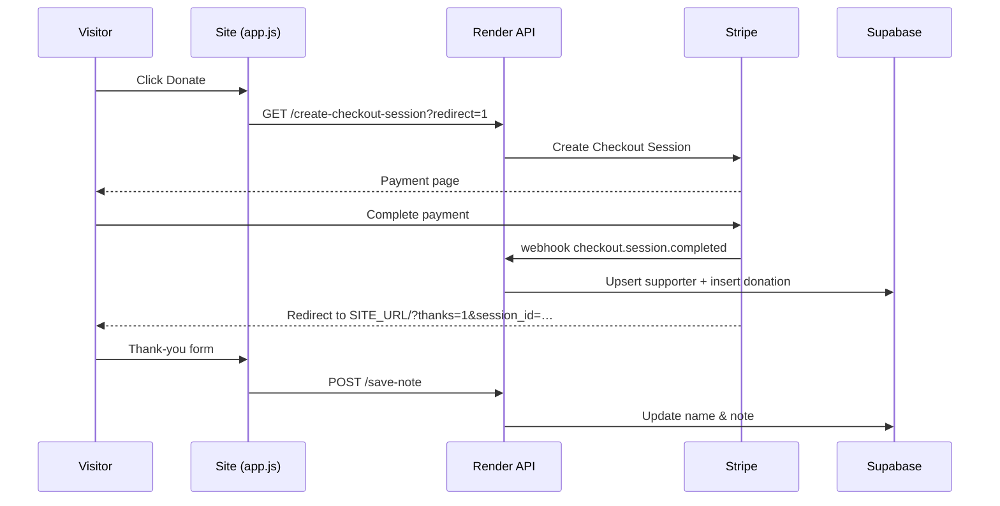

<div align="center">

# DELEXO

**Personal portfolio, project hub, and supporter leaderboard**

*Documenting the journey — projects, courses, certifications, and the people backing the work.*

<br>

[](https://delexo.store)
[](https://github.com/Delexoo/About-Me)
[](https://support-leaderboard-backend.onrender.com/health)

<br>

[](https://developer.mozilla.org/en-US/docs/Web/HTML)
[](https://developer.mozilla.org/en-US/docs/Web/CSS)
[](https://developer.mozilla.org/en-US/docs/Web/JavaScript)
[](https://nodejs.org/)
[](https://expressjs.com/)
[](https://stripe.com/)
[](https://supabase.com/)
[](https://www.netlify.com/)

<br>


<br>

**[delexo.store](https://delexo.store)** · **[GitHub](https://github.com/Delexoo)** · **[Spotify](https://open.spotify.com/user/31dn6hrf3fbxdrfabi2wpqvwvaju)**

</div>

---

## Preview

<a href="https://delexo.store" target="_blank">
  
</a>
<a href="https://delexo.store/#supporters" target="_blank">
  
</a>

<p align="center"><sub>Featured project tiles from the live portfolio. <a href="https://delexo.store">Open the full site →</a></sub></p>

---

## Table of contents

- [Overview](#overview)
- [Features](#features)
- [Architecture](#architecture)
- [Tech stack](#tech-stack)
- [Repository structure](#repository-structure)
- [Quick start](#quick-start)
- [Environment variables](#environment-variables)
- [Deployment](#deployment)
- [API reference](#api-reference)
- [Supporters flow](#supporters-flow)
- [Featured projects](#featured-projects)
- [Contributing](#contributing)
- [Links](#links)

---

## Overview

**DELEXO** is a fast, static-first personal site for **Delexo** — cybersecurity & computer science student, builder, and creator. It brings together:

- A curated **projects** grid (live products, experiments, and upcoming work)
- **Courses** (programs in progress and favorites)
- An interactive **journey** timeline
- A **Top supporters** leaderboard powered by **Stripe Checkout** + **Supabase**
- **About**, certifications, and **FAQ**
- Legal pages via [`site-information.html`](site-information.html)

The frontend is vanilla HTML/CSS/JS with no framework lock-in. The supporters backend runs on **Express** (Render) with an alternate **Netlify Functions** deployment path.

---

## Features

| Area | Highlights |
|------|------------|
| **Hero & navigation** | Splash screen, scroll progress indicator, section-aware nav, mobile dropdown menu |
| **Projects** | App-tile grid with hover states and external links |
| **Courses** | Program cards + favorite course reels |
| **Journey** | Scroll-driven timeline |
| **Supporters** | Live top-5 leaderboard, Stripe donations, post-payment name & note |
| **Accessibility** | Semantic HTML, ARIA labels, `prefers-reduced-motion` support |
| **Performance** | Static assets, lazy-loaded images, minimal JS bundle |

---

## Architecture

```mermaid
flowchart TB
  subgraph Client["Browser"]
    HTML[index.html]
    CSS[style.css]
    JS[app.js]
  end

  subgraph Hosting["Static hosting"]
    Netlify[Netlify / GitHub Pages / delexo.store]
  end

  subgraph Backend["support-leaderboard-backend · Render"]
    API[Express server.js]
    WH[/stripe-webhook]
  end

  subgraph Services["Third-party"]
    Stripe[Stripe Checkout]
    DB[(Supabase PostgreSQL)]
  end

  HTML --> Netlify
  CSS --> Netlify
  JS --> Netlify
  JS -->|leaderboard · checkout · save-note| API
  API --> Stripe
  Stripe -->|checkout.session.completed| WH
  WH --> DB
  API --> DB
```

---

## Tech stack

| Layer | Technology |
|-------|------------|
| Markup & style | HTML5, CSS3 (custom properties, grid, flex) |
| Client logic | Vanilla JavaScript (ES modules via `app.js`) |
| API server | Node.js, Express 5 |
| Payments | Stripe Checkout Sessions + webhooks |
| Database | Supabase (Postgres) — `supporters`, `donations` |
| Deploy | Netlify (static + functions), Render (API) |
| Fonts | Fraunces, Inter, Outfit (Google Fonts) |

---

## Repository structure

```
aboutme/
├── index.html              # Main portfolio page
├── site-information.html   # Privacy, terms, supporter registry
├── about.html              # About / connect page
├── css/
│   └── style.css           # All site styles
├── js/
│   └── app.js              # Nav, scroll, supporters, FAQ
├── server.js               # Express API + optional static server
├── netlify/
│   └── functions/          # Serverless API alternative
├── supabase/
│   └── migrations/         # Supporters schema
├── SUPPORTERS_DB.sql       # Standalone SQL bootstrap
├── env.example             # Environment template
├── netlify.toml            # Netlify redirects → functions
└── package.json
```

---

## Quick start

### 1. Clone & install

```bash
git clone https://github.com/Delexoo/About-Me.git
cd About-Me
npm install
```

### 2. Configure environment

```bash
cp env.example .env
```

Fill in Stripe and Supabase values (see [Environment variables](#environment-variables)).

### 3. Run locally (full stack)

```bash
npm start
```

Open **[http://localhost:3000](http://localhost:3000)** — the API is same-origin on port `3000`, so checkout and the leaderboard work without CORS setup.

### 4. Static preview only

Open `index.html` with Live Server or any static host. The site calls the production API at:

```
https://support-leaderboard-backend.onrender.com
```

Donate uses a **redirect-based checkout** (no CORS preflight) when talking to Render.

---

## Environment variables

Copy [`env.example`](env.example) to `.env` (never commit real secrets).

| Variable | Required | Description |
|----------|----------|-------------|
| `STRIPE_SECRET_KEY` | Yes | `sk_test_` or `sk_live_` from Stripe Dashboard |
| `STRIPE_WEBHOOK_SECRET` | Yes | `whsec_` signing secret from your webhook endpoint |
| `PRICE_ID` | Yes | Stripe Price ID for donations |
| `SITE_URL` | Yes | Public site URL (Stripe success/cancel redirects) |
| `SUPABASE_URL` | Yes | Supabase project URL |
| `SUPABASE_SERVICE_ROLE_KEY` | Yes | Service role key (server-only) |
| `CORS_ORIGIN` | No | `*` or comma-separated allowed origins |
| `PORT` | No | Default `3000` |
| `SERVE_STATIC` | No | Set `1` to serve `index.html` from Express |

### Database setup

Apply the supporters schema:

```bash
# Option A — Supabase CLI
supabase db query --linked -f SUPPORTERS_DB.sql

# Option B — paste SUPPORTERS_DB.sql into Supabase SQL Editor
```

### Stripe webhook

| Field | Value |
|-------|-------|
| **URL** | `https://support-leaderboard-backend.onrender.com/stripe-webhook` |
| **Event** | `checkout.session.completed` |
| **Secret** | → `STRIPE_WEBHOOK_SECRET` on Render |

---

## Deployment

### Static site (Netlify / custom domain)

1. Connect this repo to Netlify (or deploy `index.html`, `css/`, `js/` anywhere).
2. Point your domain (e.g. `delexo.store`) at the host.
3. Ensure `window.SUPPORTERS_API_BASE` in `index.html` points at your API.

### API (Render)

1. Create a **Web Service** from this repo; start command: `npm start`.
2. Set all [environment variables](#environment-variables).
3. Set `CORS_ORIGIN=*` (or list your domains).
4. Redeploy after `server.js` changes.

<details>
<summary><strong>Render environment checklist</strong></summary>

```env
SUPABASE_URL=https://your-project.supabase.co
SUPABASE_SERVICE_ROLE_KEY=...
STRIPE_SECRET_KEY=sk_live_...
STRIPE_WEBHOOK_SECRET=whsec_...
PRICE_ID=price_...
SITE_URL=https://delexo.store
CORS_ORIGIN=*
```

</details>

### Netlify Functions (alternative API)

[`netlify.toml`](netlify.toml) maps API routes to `netlify/functions/`. Set the same env vars in the Netlify dashboard.

---

## API reference

Base URL (production): `https://support-leaderboard-backend.onrender.com`

| Method | Endpoint | Description |
|--------|----------|-------------|
| `GET` | `/health` | Health check |
| `GET` | `/leaderboard?limit=5` | Top supporters by `total_cents` |
| `GET` | `/create-checkout-session?redirect=1` | Create Stripe session → redirect |
| `POST` | `/create-checkout-session` | Create session → `{ url }` JSON |
| `POST` | `/save-note` | Save display name & note after payment |
| `GET` | `/supporter?session_id=…` | Load supporter for thank-you form |
| `POST` | `/stripe-webhook` | Stripe webhook (server-only) |

---

## Supporters flow



---

## Featured projects

| Project | Link |
|---------|------|
| Free University Tools | [freeuniversitytools.com](https://freeuniversitytools.com/) |
| Serverly | [serverly.store](https://www.serverly.store/) |
| Beats | [delexoo.github.io/beats](https://delexoo.github.io/beats/) |
| GitReplay | [delexoo.github.io/GitReplay](https://delexoo.github.io/GitReplay/) |
| Vanta | [delexoo.github.io/vanta](https://delexoo.github.io/vanta/) |
| PrankApp | [github.com/Delexoo/PrankApp](https://github.com/Delexoo/PrankApp) |

---

## Contributing

This is a personal portfolio repo. Issues and PRs for bugs or documentation improvements are welcome.

1. Fork the repository
2. Create a feature branch (`git checkout -b fix/description`)
3. Commit your changes
4. Open a pull request

Please **do not** commit `.env`, `essential variables.txt`, or `render-env.txt` — they are gitignored.

---

## Links

<div align="center">

| | |
|---|---|
| **Website** | [delexo.store](https://delexo.store) |
| **GitHub** | [@Delexoo](https://github.com/Delexoo) |
| **Spotify** | [Profile](https://open.spotify.com/user/31dn6hrf3fbxdrfabi2wpqvwvaju) |
| **Venmo** | [@onepoundcoins](https://account.venmo.com/u/onepoundcoins) |
| **Cash App** | [$VXQQ](https://cash.app/$VXQQ) |
| **Privacy & Terms** | [site-information.html](https://delexo.store/site-information.html) |

<br>

[](https://star-history.com/#Delexoo/About-Me&Date)

<br>

<sub>Built by <a href="https://github.com/Delexoo">Delexo</a> · Cybersecurity & Computer Science</sub>

</div>
